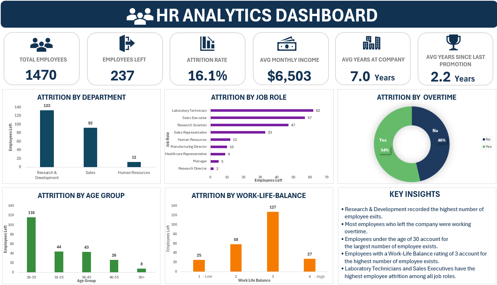
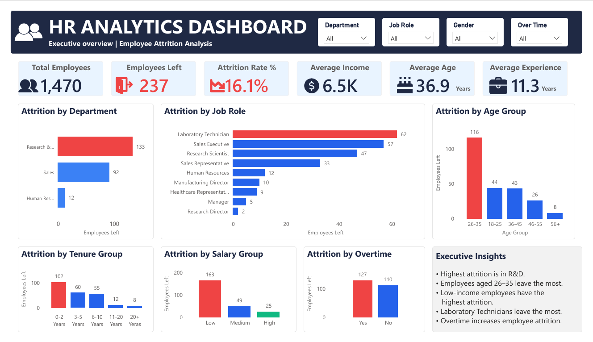
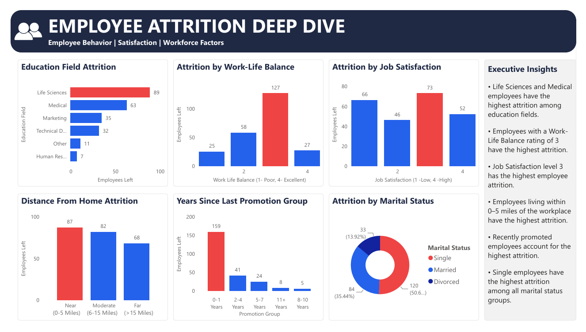

# 📊 Employee Attrition Analytics

## 📌 Project Overview

This is an end-to-end Employee Attrition Analytics project built using **MySQL, Microsoft Excel, and Power BI**. The project demonstrates the complete analytics workflow, from data cleaning and SQL analysis to dashboard development in both Excel and Power BI. The objective is to analyze employee attrition patterns, identify the key drivers of employee turnover, and provide actionable business recommendations to improve employee retention.

---

## 🎯 Business Problem

Employee attrition is a major challenge for organizations because losing experienced employees directly impacts productivity, increases recruitment costs, and affects overall business performance. This project analyzes employee demographics, job-related factors, workplace satisfaction, and compensation to identify high-risk employee groups, understand attrition patterns, and support data-driven HR decision-making.

---

## 🎯 Project Objectives

* Analyze employee attrition patterns.
* Identify high-risk employee groups.
* Measure employee attrition and key HR metrics.
* Build interactive Excel and Power BI dashboards.
* Generate actionable business recommendations.

---

## 🛠️ Tools & Technologies

| Tool | Purpose |
|------|---------|
| **SQL (MySQL)** | Data import, data cleaning, data preparation, and business analysis |
| **Microsoft Excel** | Data validation, interactive dashboard, KPI reporting |
| **Power BI** | Interactive dashboards and data visualization |
| **Git & GitHub** | Version control and project portfolio |

---

## 📂 Dataset Information

**Dataset:** IBM HR Analytics Employee Attrition Dataset

The dataset contains employee information including:

- Employee Demographics
- Department
- Job Role
- Age
- Gender
- Marital Status
- Education Field
- Monthly Income
- Total Working Years
- Years at Company
- Distance from Home
- Overtime
- Job Satisfaction
- Environment Satisfaction
- Work-Life Balance
- Performance Rating
- Attrition Status

---

## 🔄 Project Workflow

```text
Raw Dataset
      ↓
SQL Data Import & Cleaning
      ↓
SQL Data Preparation
      ↓
SQL Business Analysis
      ↓
Excel Validation
      ↓
Power BI Dashboard
      ↓
Business Insights
      ↓
Business Recommendations
```

---

## 💾 SQL Work Completed

* Data Import
* Data Cleaning
* Data Preparation
* SQL Business Analysis
* SQL Views
* Stored Procedures
* Advanced SQL
* Final HR Report

### 📊 Microsoft Excel Dashboard

An interactive Excel dashboard was created to provide a high-level overview of employee attrition. The dashboard uses Pivot Tables, Pivot Charts, and KPI cards to summarize workforce metrics and highlight important employee attrition trends.

**KPI Cards**

- Total Employees
- Employees Left
- Attrition Rate
- Average Age
- Average Monthly Income

**Visuals**

- Attrition by Department
- Attrition by Job Role
- Attrition by Age Group
- Attrition by Overtime

**Dashboard Features**

- KPI Cards
- Pivot Charts
- Key Insights Section

---

## 📈 Power BI Dashboard

### Page 1 — HR Executive Dashboard

**KPIs**

* Total Employees
* Employees Left
* Attrition Rate
* Average Income
* Average Age
* Average Experience

**Visuals**

* Attrition by Department
* Attrition by Job Role
* Attrition by Age Group
* Attrition by Tenure Group
* Attrition by Salary Group
* Attrition by Overtime

**Executive Insights**

* Research & Development has the highest employee attrition.
* Laboratory Technicians experience the highest attrition among job roles.
* Employees aged **26–35** have the highest attrition.
* Low-income employees experience the highest attrition.
* Employees with **0–2 years** of tenure leave the company most frequently.
* Employees working overtime have significantly higher attrition.

---

### Page 2 — Employee Insights Dashboard

**Visuals**

* Education Field Attrition
* Attrition by Work-Life Balance
* Attrition by Job Satisfaction
* Distance from Home Attrition
* Years Since Last Promotion Group
* Attrition by Marital Status

**Executive Insights**

* Employees from the **Life Sciences** and **Medical** education fields experience the highest attrition.
* Employees with a **Work-Life Balance rating of 3** have the highest attrition.
* Job Satisfaction **Level 3** records the highest employee attrition.
* Employees living within **0–5 miles** from the workplace have the highest attrition.
* Recently promoted employees account for the highest attrition.
* Single employees have the highest attrition among all marital status groups.

---

## 💡 Key Insights

* Research & Development has the highest employee attrition.
* Laboratory Technicians experience the highest attrition among all job roles.
* Employees aged **26–35** have the highest attrition.
* Employees with lower monthly incomes experience significantly higher attrition.
* Employees with **0–2 years** of tenure leave the company most frequently.
* Employees working overtime have higher attrition.
* Employees from the **Life Sciences** and **Medical** education fields have the highest attrition.
* Employees with a **Work-Life Balance rating of 3** have the highest attrition.
* Job Satisfaction **Level 3** records the highest attrition.
* Employees living within **0–5 miles** from the workplace have the highest attrition.
* Recently promoted employees account for the highest attrition.
* Single employees have the highest attrition among all marital status groups.

---

## 🚀 Business Recommendations

* Reduce overtime through improved workforce planning and resource allocation.
* Develop targeted retention programs for employees during their first two years with the company.
* Review compensation strategies for lower-income employee groups.
* Create career development and mentorship programs for high-turnover job roles.
* Strengthen employee engagement initiatives within the Research & Development department.
* Improve work-life balance by introducing flexible work policies where applicable.
* Provide clear promotion pathways and career growth opportunities.
* Enhance employee recognition and engagement programs for single and early-career employees.
* Monitor employee attrition using interactive dashboards to support proactive HR decision-making.

---

## 📁 Project Structure

```text
HR-Analytics-Employee-Attrition/
│
├── Dataset/
│   └── IBM_HR_Analytics_Dataset.csv
│
├── SQL/
│   ├── 01_Data_Import_and_Cleaning.sql
│   ├── 02_Data_Preparation.sql
│   ├── 03_SQL_Analysis.sql
│   ├── 04_SQL_Views.sql
│   ├── 05_Stored_Procedure.sql
│   ├── 06_Advanced_SQL.sql
│   └── 07_Final_Report.sql
│
├── Excel/
│   └── HR_Analytics.xlsx
│
├── Power BI/
│   └── Employee_Attrition_Analytics.pbix
│
├── Images/
│   ├── Excel_HR_Analytics_Dashboard.png
│   ├── PowerBI_HR Executive_Dashboard.png
│   └── PowerBI_Employee_Insights_Dashboard.png
│
└── README.md
```

---

## 🧠 Skills Demonstrated

- SQL
- SQL Data Cleaning
- SQL Data Preparation
- SQL Business Analysis
- SQL Views
- Stored Procedures
- Advanced SQL
- Business Analysis
- Microsoft Excel
- Pivot Tables
- Pivot Charts
- Interactive Dashboard Design
- KPI Design
- DAX Measures
- Power BI Dashboard Development
- Data Visualization
- Business Storytelling

---

## 📷 Dashboard Preview

### Microsoft Excel Dashboard



### Power BI HR Executive Dashboard



### Power BI Employee Insights Dashboard



---

## 📌 Conclusion

This project demonstrates an end-to-end HR analytics workflow, from raw data preparation in SQL to interactive dashboard development in Microsoft Excel and Power BI. The analysis highlights the key drivers of employee attrition, identifies high-risk employee groups, and provides actionable recommendations to improve employee retention, optimize workforce planning, and support data-driven HR decision-making.

---

### 👤 Created by Simranpreet Kaur

Aspiring Data Analyst | SQL | Excel | Power BI | Business Intelligence
